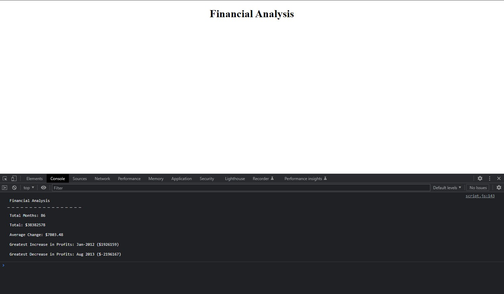

# Console-Finances

## Description
The current project presents a real-world situation in which we apply the JavaScript fundamentals 
acquired so far, and hence create code to analyse a company's financial records.

## Table of contents
<ul>
    <li>Screenshot</li>
    <li>User Story</li>
    <li>Acceptance Criteria</li>
    <li>Technologies</li>
    <li>Installation</li>
    <li>Usage</li>
    <li>Documentation</li>
    <li>License</li>
    <li>Author</li>
</ul>

## Screenshot

## User Story
As an employer I want to be able to see the output of a company's financial record. The script file would allow me to assess the ability of the potential employee's to rely on Pseudocoding to solve a
problem.

## Acceptance Criteria
<ul>
    <li>Having an active and healthy commit history on GitHub</li>
    <li>Repository contains quality readme with description, screenshot, link to deployed application</li>
    <li>Repository follows best practices for variable naming conventions, indentation, quality comments, etc</li>
    <li>Use of JavaScript fundamentals to solve a problem</li>
</ul>

## Technologies
 <ul>
    <li>HTML 5</li>
    <li>JavaScript 5</li>
 </ul>

## Installation
No installation is required. 
## Usage
<ul>
    <li>Click on the url of the website. Please refer to the deployment section</li>
    <li>Consult the inspection tool and the console tab to see the output</li>
</ul>

## Documentation
<ul>
    <li><a>https://eloquentjavascript.net/</a></li>
    <li><a>https://books.google.us/books/about/JavaScript.html?id=vJGlu9t9LNYC&redir_esc=y</a></li>
    <li><a>https://www.w3schools.com/</a></li>
    <li><a>https://developer.mozilla.org/en-US/</a></li>
</ul>

## License
Console-Finances is under MIT License.

## Deployment
 <ul>
    <li>Website: https://cedagbo.github.io/Finances//</li>
    <li>Repository: https://github.com/cedagbo/Console-Finances </li>
 </ul>

## Author
@cedagbo

